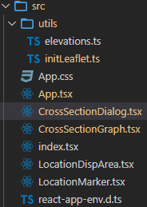

# ドラッグした区間の断面図を表示する地図(React)

https://murasuke.github.io/map-cross-section-view/


## はじめに

以前、2つの地点(座標)を手入力して、その間の断面図を表示する[アプリ](https://qiita.com/murasuke/items/03d7c4bf9e816a34b7f1)を作りました

[2つの地点間の断面図(標高)をグラフで表示する](https://qiita.com/murasuke/items/03d7c4bf9e816a34b7f1)

経度、緯度の手入力は面倒なので、**地図上をドラッグしてその区間の断面図を表示**できるアプリに仕立て直します

## 概要

### [Leaflet](https://leafletjs.com/)
地図を表示するためのJavaScriptライブラリ。表示する地図は持たないので[OpenStreetMap](https://www.openstreetmap.org/about)や、[国土地理院タイル](https://maps.gsi.go.jp/development/siyou.html)と組み合わせて利用する


### [React Leaflet](https://react-leaflet.js.org/)

LeafletをReact コンポーネントとして使うためのライブラリ(ラッパー)

下記のように直感的でわかりやすくコンポーネント化されている

* 富士山を表示するだけの最低限のサンプル
```jsx
import { MapContainer, TileLayer } from 'react-leaflet';

const App = () => (
  <MapContainer center={[35.3607411, 138.727262]} zoom={13}>
    <TileLayer
      attribution='&copy; <a href="https://maps.gsi.go.jp/development/ichiran.html">国土地理院</a>'
      url="https://cyberjapandata.gsi.go.jp/xyz/std/{z}/{x}/{y}.png"
    />
  </MapContainer>
);
```

###  [国土地理院タイル](https://maps.gsi.go.jp/development/siyou.html)

国土地理院が配信するタイル状の地図データ

[標準地図](https://maps.gsi.go.jp/development/ichiran.html#std)をLearletで表示し、2つの地点間を[標高タイル](https://maps.gsi.go.jp/development/demtile.html)を使って断面図にします


詳細は下記を参照
* [国土地理院-地理院タイルについて](https://maps.gsi.go.jp/development/siyou.html)
* [緯度、経度をもとに国土地理院タイルを表示する方法](https://qiita.com/murasuke/items/ad81b7b726a3463fa3fe)

### 断面図

[標高タイル](https://maps.gsi.go.jp/development/demtile.html)で求めた2点間の標高を元に、[Plotly.js](https://plotly.com/javascript/)でグラフ化します

※[Chart.js](https://www.chartjs.org/)は、X軸とY軸を同じ比率にできない(距離と標高を正確に合わせられない)ため、[Plotly.js](https://plotly.com/javascript/)を利用している


## プログラムの概要

* 地図を表示する (App.tsx)
  * [React Leaflet](https://react-leaflet.js.org/)で、国土地理院タイルを表示する
  * マーカーの表示にちょっと癖があるので、正しく表示するための初期化を行う
  * 右上に「位置表示エリア」を表示

* 位置表示エリア (LocationDispArea.tsx)
  * クリックした位置の「標高」「緯度、経度」を表示

* 地図上にマーカーを表示 (LocationMarker.tsx)
  * クリックでマーカーを移動
  * マーカーをドラッグして地図上に線を引く
  * ドラッグが終わったタイミングで断面図を表示する

* 断面図 (CrossSectionDialog.tsx, CrossSectionGraph.tsx)
  * 断面図の作成方法は[2つの地点間の断面図(標高)をグラフで表示する](https://qiita.com/murasuke/items/03d7c4bf9e816a34b7f1)を参照
  * [rc-dialog](https://www.npmjs.com/package/rc-dialog) (React用のダイアログ表示ライブラリ)を使い、生成した断面図を表示する

https://qiita.com/murasuke/items/03d7c4bf9e816a34b7f1


### 利用ライブラリ
```
npm i leaflet plotly.js rc-dialog react-draggable react-leaflet react-plotly.js react-leaflet-custom-control
npm i -D @types/leaflet @types/react-plotly.js
```

* [react-draggable](https://www.npmjs.com/package/react-draggable) は、ダイアログの移動のために利用
 * [react-leaflet-custom-control](https://www.npmjs.com/package/react-leaflet-custom-control) は、地図(React Leaflet)上に、コントロールを配置するためのライブラリ

 ### ファイル構成

* react-create-app (TypeScriptを有効)で作成

 

|  ファイル名  |  概要  |
| ---- | ---- |
|  index.tsx  |  エントリーポイント(変更なし)  |
|  App.tsx  |  地図を表示するための&lt;MapContainer&gt;(ReactLeaflet)と、断面図表示用の&lt;CrossSectionDialog&gt;を持つ |
|  App.css  |  地図をブラウザいっぱいに表示するためのスタイル設定  |
|  LocationDispArea.tsx  |  クリックした位置の「標高」「緯度」「経度」を表示する位置情報表示エリア  |
|  LocationMarker.tsx  |  位置表示アイコン。ドラッグ完了時、CustomEventで通知する  |
|  CrossSectionDialog.tsx  | 断面図をダイアログとして表示する。[rc-dialog](https://www.npmjs.com/package/rc-dialog)を利用   |
|  CrossSectionGraph.tsx  |  plotly.jsを利用して、2座標間の断面図を描画する。[Plotly.js](https://plotly.com/javascript/)を利用  |
|  utils\elevations.ts  |  2つの座標の間の標高を求める処理([国土地理院標高タイル](https://maps.gsi.go.jp/development/demtile.html)を利用)  |
|  utils\initLeaflet.ts  |  地図に表示するマーカーの初期設定  |

## プログラムソース説明

### App.tsx

```tsx
import { FC, useState } from 'react';
import { LatLngLiteral } from 'leaflet';
import { MapContainer, TileLayer } from 'react-leaflet';

import './utils/initLeaflet'; // アイコン表示位置の調整
import LocationDispArea from './LocationDispArea';
import LocationMarker from './LocationMarker';
import CrossSectionDialog from './CrossSectionDialog';

import 'leaflet/dist/leaflet.css';
import './App.css';

/**
 * 標高の断面図表示アプリ
 * ・地図のアイコンをドラッグした区間の断面図を表示する
 * ・地図上をクリックするとアイコンが移動する
 * ・右上の情報表示領域に標高と緯度経度が表示される
 * ・JavaScriptのCustomEventでコンポーネントを跨いだ通知(断面図表示)を行う
 * @returns
 */
const App: FC = () => {
  // クリックされた位置(初期位置は富士山頂)
  const [location, setLocation] = useState<LatLngLiteral>({
    lat: 35.3607411,
    lng: 138.727262,
  });
  // ダイアログ表示切り替え
  const [visibleDialog, setVisibleDialog] = useState(false);

  /**
   * <MapContainer> ReactLeafletの地図を表示するコンテナ
   *   <TileLayer> 国土地理院タイルを表示するレイヤー(複数レイヤーを切り替えたり、オーバーレイ表示することもできる)
   *   <LocationDispArea> マップの右上に表示する情報表示領域(標高、緯度、経度)
   *   <LocationMarker> クリック位置を表すアイコン
   * <CrossSectionDialog> 標高の断面図を表示するためのダイアログ(内部でグラフを表示)
   */
  return (
    <>
      <MapContainer center={location} zoom={13}>
        <TileLayer
          attribution='&copy; <a href="https://maps.gsi.go.jp/development/ichiran.html">国土地理院</a>'
          url="https://cyberjapandata.gsi.go.jp/xyz/std/{z}/{x}/{y}.png"
        />
        <LocationDispArea location={location} />
        <LocationMarker location={location} setLocation={setLocation} />
      </MapContainer>
      <CrossSectionDialog
        visible={visibleDialog}
        setVisible={setVisibleDialog}
      />
    </>
  );
};

export default App;
```

### App.css

```css
/* 地図を画面全体に表示 */
body {
  margin: 0;
}

.leaflet-container {
  width: 100vw;
  height: 100vh;
}

/* カーソルを標準に戻す(標準の手アイコンは位置を正確に選択しづらい) */
.leaflet-grab {cursor: auto;}

```

### LocationDispArea.tsx

```tsx
import { FC, useEffect, useState } from 'react';
import { LatLngLiteral } from 'leaflet';

import Control from 'react-leaflet-custom-control';
import { getElevation } from './utils/elevations';

type ElevationType = {
  h: number;
  lat: number;
  lng: number;
};

/**
 * 位置情報表示エリア
 * ・クリックした位置の「標高」「緯度」「経度」を表示するエリア
 * ・propsで位置を受け取り、位置から「標高」を求めて表示する
 * ・react-leaflet-custom-controlでラップすることで、マップ上にオーバーレイ表示する
 */
const LocationIndicator: FC<{ location: LatLngLiteral }> = ({ location }) => {
  const f = (num: number, fixed = 6) =>
    ('             ' + num.toFixed(fixed)).slice(-6 - fixed);
  const formatAlt = (alt: ElevationType) =>
    `標高:${f(alt.h ?? 0)}m\n緯度:${f(alt.lat)}\n経度:${f(alt.lng)}`;

  const [altitude, setAlt] = useState<ElevationType>();

  // 位置から標高を取得する
  useEffect(() => {
    getElevation(location.lat, location.lng).then((h) => {
      setAlt({ h, lat: location.lat, lng: location.lng });
    });
  }, [location]);

  // 地図領域右上(topright)に、標高と緯度、経度を表示する
  return (
    <Control position="topright">
      <div style={{ backgroundColor: 'Lavender' }}>
        <pre className="coords">{altitude ? formatAlt(altitude) : ''}</pre>
      </div>
    </Control>
  );
};

export default LocationIndicator;

```

### LocationMarker.tsx

```tsx
import { FC, useState, useMemo, useRef } from 'react';
import { LatLngLiteral, Marker as MarkerRef, Popup as PopupRef } from 'leaflet';
import { Marker, Polyline, Popup, useMap, useMapEvents } from 'react-leaflet';

// カスタムイベントの型設定(マーカーのドラッグ終了)
declare global {
  interface DocumentEventMap {
    MarkerDragEnd: CustomEvent<LatLngLiteral[]>;
  }
}

type propType = {
  location: LatLngLiteral;
  setLocation: React.Dispatch<React.SetStateAction<LatLngLiteral>>;
};

// 現在の位置をgoogleで開くためのURL
const gmap = 'https://www.google.com/maps/search/?api=1&query=';

/**
 * 位置表示アイコン
 * ・クリックした位置にアイコン表示する
 *   ・ドラッグ完了時、CustomEventで通知する
 */
const LocationMarker: FC<propType> = ({ location, setLocation }) => {
  const [polyline, setPolyline] = useState<LatLngLiteral[]>([]);
  const markerRef = useRef<MarkerRef>(null);
  const popRef = useRef<PopupRef>(null);
  const dragEndTime = useRef<number>(0);
  const map = useMap();
  useMapEvents({
    click: (e) => {
      setLocation(e.latlng);
    },
  });

  const eventHandlers = useMemo(
    () => ({
      dragstart: () => {
        const marker = markerRef.current as MarkerRef;
        marker.setOpacity(0.6);

        setPolyline((ary) => {
          // 開始位置、終了位置を開始位置で初期化
          return [marker.getLatLng(), marker.getLatLng()];
        });
      },
      dragend: () => {
        const marker = markerRef.current as MarkerRef;
        marker.setOpacity(1);
        popRef.current?.openOn(map);
        setLocation(marker.getLatLng());
        dragEndTime.current = new Date().getTime();

        // ダイアログ表示イベントを配信
        const event = new CustomEvent('MarkerDragEnd', { detail: polyline });
        document.dispatchEvent(event);
      },
      drag: () => {
        const marker = markerRef.current as MarkerRef;
        // 終了位置を更新
        setPolyline((ary) => [
          ...ary.slice(0, ary.length - 1),
          marker.getLatLng(),
        ]);
      },
    }),
    [map, setLocation, polyline]
  );

  /**
   * <Marker> クリック位置に表示するアイコン
   * <Popup> アイコン上に表示する吹き出し(googleマップで開く)
   * <Polyline> 直線(Markerをドラッグ＆ドロップして直線を引く)
   */

  return !location ? null : (
    <>
      <Marker
        draggable={true}
        eventHandlers={eventHandlers}
        position={location}
        ref={markerRef}
      >
        <Popup ref={popRef}>
          {' '}
          <a href={`${gmap}${location.lat},${location.lng}`} target="blank">
            googleマップで開く
          </a>
        </Popup>
      </Marker>
      <Polyline positions={polyline} color="green" />
    </>
  );
};

export default LocationMarker;

```

### CrossSectionDialog.tsx

```tsx
import React, { FC, useEffect, useState } from 'react';
import Dialog from 'rc-dialog';
import Draggable from 'react-draggable';
import { LatLngLiteral } from 'leaflet';
import CrossSectionGraph from './CrossSectionGraph';
import 'rc-dialog/assets/index.css';

type propType = {
  visible: boolean;
  setVisible: React.Dispatch<React.SetStateAction<boolean>>;
};

/**
 * 断面図のダイアログ
 * ・位置アイコンをドラッグした際に発生する、MarkerDragEndイベントを捕捉
 * ・イベント経由で、2つの座標を受け取り断面図ダイアログを表示する
 * ・断面図(グラフ)自体の描画は、<CrossSectionGraph>側で行う
 * @param param0
 * @returns
 */
const CrossSectionDialog: FC<propType> = ({ visible, setVisible }) => {
  const [points, setPoints] = useState<LatLngLiteral[]>();
  const [ratio, setRatio] = useState<string>('1.0');
  const [disabled, setDisabled] = useState(true);
  useEffect(() => {
    // 位置アイコンを移動した際に発生する「MarkerDragEnd」イベントを講読する
    document.addEventListener('MarkerDragEnd', showDialog);
    return () => {
      // unsubscribe event
      document.removeEventListener('MarkerDragEnd', showDialog);
    };
  });

  // MarkerDragEndイベント経由で、2つの座標を受け取り断面図ダイアログを表示する
  async function showDialog(data: CustomEvent<LatLngLiteral[]>) {
    setRatio('1.0');
    setPoints(data.detail);
    setVisible(true);
  }

  const onToggleDialog = () => {
    setVisible((value) => !value);
  };

  /**
   * <Dialog> ダイアログ表示コンポーネント(rc-dialog)
   * <Draggable> ダイアログをドラッグで移動できるようにするためのコンポーネント
   * <CrossSectionGraph> 断面図
   */
  return (
    <>
      <Dialog
        visible={visible}
        animation="zoom"
        maskAnimation="fade"
        onClose={onToggleDialog}
        forceRender
        title={
          <div
            style={{
              width: '100%',
              cursor: 'pointer',
            }}
            onMouseOver={() => {
              if (disabled) {
                setDisabled(false);
              }
            }}
            onMouseOut={() => {
              setDisabled(true);
            }}
          >
            断面図
          </div>
        }
        modalRender={(modal) => (
          <Draggable disabled={disabled}>{modal}</Draggable>
        )}
      >
        <div>
          縦横比：
          <select
            id="ratio"
            value={ratio}
            onChange={(e) => setRatio(e.target.value)}
          >
            <option value="1.0">1.0</option>
            <option value="2.0">2.0</option>
            <option value="3.0">3.0</option>
            <option value="4.0">4.0</option>
            <option value="5.0">5.0</option>
            <option value="7.0">7.0</option>
            <option value="10.0">10.0</option>
            <option value="15.0">15.0</option>
            <option value="20.0">20.0</option>
            <option value="30.0">30.0</option>
            <option value="50.0">50.0</option>
          </select>
        </div>
        {points && (
          <CrossSectionGraph points={points} ratio={Number.parseInt(ratio)} />
        )}
      </Dialog>
    </>
  );
};

export default CrossSectionDialog;

```

### CrossSectionGraph.tsx

```tsx
import { FC, useEffect, useState } from 'react';
import { LatLngLiteral } from 'leaflet';
import Plot from 'react-plotly.js';
import { getElevations, getDistance } from './utils/elevations';

type plotData = {
  x: number[];
  y: number[];
};

type propType = {
  points: LatLngLiteral[]; // 断面図に必要な2点を配列で渡す
  ratio: number; // x軸とy軸の縦横比(高さを強調したい場合は1より大きい数を渡す)
};

/**
 * plotly.jsを利用して、2座標間の断面図を描画する
 * ・標高タイルから2つの座標間の標高を取得(./utils/elevations参照)して、断面図を生成する
 * ・x軸とy軸の倍率は、ratioで設定する(1だと等倍、2以上は高さが強調される)
 * @param param0
 * @returns
 */
const CrossSectionGraph: FC<propType> = ({ points, ratio }) => {
  const [plotData, setPlotData] = useState<plotData>();

  useEffect(() => {
    if (points) {
      const [lat1, lng1] = [points[0].lat, points[0].lng];
      const [lat2, lng2] = [points[1].lat, points[1].lng];

      // 2点間の標高、距離を計算する
      (async () => {
        const elevations = await getElevations(lat1, lng1, lat2, lng2);
        const distance = getDistance(lat1, lng1, lat2, lng2) * 1000;

        // 分割した区間あたりの距離(標高を求めた区間あたりの距離)
        const distancePerUnit = distance / elevations.length;
        const xy: plotData = { x: [], y: [] };

        // 標高の配列を(x:距離、y:標高)の配列に変換
        elevations.forEach((v, i) => {
          xy.x.push(i * distancePerUnit);
          xy.y.push(v);
        });

        setPlotData(xy);
      })();
    }
  }, [points]);

  const margin = {
    // グラフ外側の空白調整
    l: 80,
    r: 10,
    b: 40,
    t: 30,
    pad: 4,
  };

  /**
   * <Plot> グラフ表示コンポーネントplotly.js
   * ・data 描画する座標の配列
   */
  return (
    <>
      {plotData && (
        <Plot
          data={[
            {
              x: plotData.x,
              y: plotData.y,
              type: 'scatter', // 散布図
              mode: 'lines', // 線でつなげる
              line: { shape: 'spline' }, // spline曲線
            },
          ]}
          layout={{
            width: 500,
            margin,
            xaxis: {
              // x軸の設定
              title: '距離',
              ticksuffix: 'm',
              exponentformat: 'none', // 指数表記しない
              rangemode: 'tozero', // 0から表示
            },
            yaxis: {
              // y軸の設定
              scaleanchor: 'x', // グラフの縦横比を等倍にする
              scaleratio: ratio, // x軸に対する倍率
              rangemode: 'tozero', // 0から表示
              title: '標高',
              ticksuffix: 'm',
              exponentformat: 'none', // 指数表記しない
            },
          }}
        />
      )}
    </>
  );
};

export default CrossSectionGraph;

```

### utils\elevations.ts

```typescript
/**
 * 2座標間を線形補完して座標を求める
 * ・標高は地理院タイルの(DEM5A)を利用
 *   https://maps.gsi.go.jp/development/ichiran.html
 */

/**
 * 特定の座標の標高を求める
 * @param lat1
 * @param lng1
 * @param zoom
 * @returns
 */
export const getElevation = async (lat1: number, lng1: number, zoom = 15) => {
  let tile = calcTileInfo(lat1, lng1, zoom);

  const context = await loadTile(tile.tX, tile.tY, zoom, {
    dataType: 'dem5a_png',
  });
  // タイルから標高を取得
  const h = elevationFromTile(tile.iX, tile.iY, context);
  return h;
};

/**
 * 2点間の標高を配列で取得する
 * @param {number} lat1
 * @param {number} lng1
 * @param {number} lat2
 * @param {number} lng2
 * @returns
 */
export const getElevations = async (
  lat1: number,
  lng1: number,
  lat2: number,
  lng2: number
) => {
  let tile1, tile2, zoom;
  // 経度、緯度から2つのPixcelの距離が128～256になるzoomlevelを選択する
  for (zoom = 0; zoom <= 15; zoom++) {
    tile1 = calcTileInfo(lat1, lng1, zoom);
    tile2 = calcTileInfo(lat2, lng2, zoom);
    // 2つのPixcelの距離が128～256になるまでzoomを増やす
    const distance = Math.sqrt(
      (tile1.pX - tile2.pX) ** 2 + (tile1.pY - tile2.pY) ** 2
    );

    if (distance > 128) {
      break;
    }
  }

  // 2点間を線形補完した座標を計算する
  const line = lerp(tile1.pX, tile1.pY, tile2.pX, tile2.pY);

  let tiles: { [index: string]: CanvasRenderingContext2D } = {}; // タイル読み込みキャッシュ
  const elevations = []; // 標高の配列

  // 補完した座標から、標高を取得して配列にセット
  for (let i = 0; i < line.length; i += 2) {
    const x = line[i];
    const y = line[i + 1];

    // タイルのindex
    const tileCoordX = Math.floor(x / 256);
    const tileCoordY = Math.floor(y / 256);
    // タイル内の座標
    const imageCoordX = Math.floor(x - tileCoordX * 256);
    const imageCoordY = Math.floor(y - tileCoordY * 256);

    let context = null; // タイルを描画したCanvas
    if (!tiles[`${tileCoordX}_${tileCoordY}`]) {
      // 標高タイルの読み込み
      context = await loadTile(tileCoordX, tileCoordY, zoom, {
        dataType: 'dem5a_png',
      });
      // 一度読み込んだタイルはキャッシュする
      tiles[`${tileCoordX}_${tileCoordY}`] = context;
    } else {
      // キャッシュからタイルを取り出す
      context = tiles[`${tileCoordX}_${tileCoordY}`];
    }

    // タイルから標高を取得
    const h = elevationFromTile(imageCoordX, imageCoordY, context);
    elevations.push(h);
  }

  return elevations;
};

/**
 * 経度から座標(タイルとタイル内pixcel)を計算
 * @param {number} lng 経度
 * @param {number} z zoomlevel
 * @returns
 */
export const calcCoordX = (lng: number, z: number) => {
  // ラジアンに変換
  const lng_rad = (Math.PI / 180) * lng;

  // zoomレベル0の場合、256pxで360度(2PIラジアン)
  //  ⇒ ラジアンあたりpxを計算
  const R = 256 / (2 * Math.PI);

  // グリニッジ子午線を原点とした位置(x) (-128～128)
  let worldCoordX = R * lng_rad;

  // 左端を原点にするために180度分を加算する(0～256)
  worldCoordX = worldCoordX + R * (Math.PI / 180) * 180;

  // 1周256px換算で計算した値にzoomをかけて、zoomで換算した画像の位置を計算
  //  ⇒ https://maps.gsi.go.jp/development/siyou.html#siyou-zm
  const pixelCoordX = worldCoordX * Math.pow(2, z);

  // 1つの画像が256pxなので、256で割って左端からの画像の枚数(タイルの位置)を求める
  // (0オリジンなので切り捨て)
  const tileCoordX = Math.floor(pixelCoordX / 256);

  // 左側のタイル幅合計を引いて、表示タイル内のpx位置を算出する
  const imageCoordX = Math.floor(pixelCoordX - tileCoordX * 256);

  // 計算した値を返す
  return {
    worldCoordX,
    pixelCoordX,
    tileCoordX,
    imageCoordX,
  };
};

/**
 * 緯度から座標(タイルとタイル内pixcel)を計算
 * メルカトル図法で緯度から位置を算出する式 (https://qiita.com/Seo-4d696b75/items/aa6adfbfba404fcd65aa)
 *  R ln(tan(π/4 + ϕ/2))
 *    R: 半径
 *    ϕ: 緯度(ラジアン)
 * @param {number} lat 緯度
 * @param {number} z zoomlevel
 * @returns
 */
export const calcCoordY = (lat: number, z: number) => {
  // ラジアン
  const lat_rad = (Math.PI / 180) * lat;

  // zoomレベル0の場合、256pxで360度(2PIラジアン)
  //  ⇒ ラジアンあたりpxを計算
  const R = 256 / (2 * Math.PI);

  // メルカトル図法で緯度から位置を算出
  let worldCoordY = R * Math.log(Math.tan(Math.PI / 4 + lat_rad / 2));

  // 赤道からの位置(北緯)で計算しているので、左上を原点とするため軸を逆転＋北極側を原点に換算
  worldCoordY = -1 * worldCoordY + 128;

  // 256px換算で計算した値にzoomをかけて、zoomで換算した画像の位置を計算
  const pixelCoordY = worldCoordY * Math.pow(2, z);

  // 1つの画像が256pxなので、256で割って左端からの画像の枚数(位置)を求める
  // 0オリジンなので切り捨て
  const tileCoordY = Math.floor(pixelCoordY / 256);

  // 上側のタイル幅合計を引いて、表示タイル内のpx位置を算出する
  const imageCoordY = Math.floor(pixelCoordY - tileCoordY * 256);

  // 計算した値を返す
  return {
    worldCoordY,
    pixelCoordY,
    tileCoordY,
    imageCoordY,
  };
};

/**
 * 指定位置に該当するタイル位置と、該当タイル内の位置を返す
 * @param {number} lat 緯度
 * @param {number} lng 経度
 * @param {number} z zoomlevel
 * @returns
 */
export const calcTileInfo = (lat: number, lng: number, z: number) => {
  // (x, y): 指定位置に該当するタイル位置
  // (pX, pY): 該当タイル内の位置
  const coordX = calcCoordX(lng, z);
  const coordY = calcCoordY(lat, z);
  return {
    wX: coordX.worldCoordX,
    wY: coordY.worldCoordY,
    pX: coordX.pixelCoordX,
    pY: coordY.pixelCoordY,
    tX: coordX.tileCoordX,
    tY: coordY.tileCoordY,
    iX: coordX.imageCoordX,
    iY: coordY.imageCoordY,
    z,
  };
};

/**
 * 読み込んだタイルをCanvasに描画して返す
 *　・色情報を取得できるようにするため、Canvasへ描画する
 * @param {number} x タイルのx枚目
 * @param {number} y タイルのy枚目
 * @param {number} z zoomlevel
 * @param { {dataType: string, ext?: string} } option タイルの種類
 * @returns {Promise<CanvasRenderingContext2D>} CanvasのContext
 */
export const loadTile = async (
  x: number,
  y: number,
  z: number,
  option: { dataType: string; ext?: string }
): Promise<CanvasRenderingContext2D> => {
  const { dataType, ext } = option;

  const url = `https://cyberjapandata.gsi.go.jp/xyz/${dataType}/${z}/${x}/${y}.${
    ext ?? 'png'
  }`;

  // Image(HTMLImageElement)を利用して画像を取得
  const img = new Image();
  img.setAttribute('crossorigin', 'anonymous');
  img.src = url;

  // 縦横256pixcelのCanvasを生成する
  const canvas = document.createElement('canvas');
  [canvas.width, canvas.height] = [256, 256];
  const ctx = canvas.getContext('2d', { willReadFrequently: true });

  // onloadは非同期で発生するため、Promise()でラップして返す
  return new Promise((resolve, reject) => {
    img.onload = () => {
      // 読み込んだ座標をCanvasに描画して返す
      ctx.drawImage(img, 0, 0);

      resolve(ctx);
    };
  });
};

/**
 * 2点間の線形補完
 * 垂直でも計算しやすいので、中間の点を求めて再帰で分割
 * ・(2^再帰の深さ + 1)に分割する
 * @param {number} p1x
 * @param {number} p1y
 * @param {number} p2x
 * @param {number} p2y
 * @param {number} maxDepth = 7
 * @param {number} depth 現在の再帰の深さ
 * @returns
 */
const lerp = (
  p1x: number,
  p1y: number,
  p2x: number,
  p2y: number,
  maxDepth = 7,
  depth = 0
): number[] => {
  if (depth >= maxDepth) {
    return [p1x, p1y];
  }
  const x = (p1x + p2x) / 2;
  const y = (p1y + p2y) / 2;
  depth += 1;
  return [
    ...lerp(p1x, p1y, x, y, maxDepth, depth),
    ...lerp(x, y, p2x, p2y, maxDepth, depth),
    ...(depth === 1 ? [p2x, p2y] : []), // 一番右端
  ];
};

/**
 * dem5aから標高を取得
 * @param {number} lat
 * @param {number} lng
 * @param {CanvasRenderingContext2D}
 * @returns {Promise<number>}
 */
export const elevationFromTile = (
  pX: number,
  pY: number,
  ctx: CanvasRenderingContext2D
) => {
  const { data } = ctx.getImageData(0, 0, 256, 256);
  // 1pxあたり4Byte(RGBA)
  const idx = pY * 256 * 4 + pX * 4;
  const r = data[idx + 0];
  const g = data[idx + 1];
  const b = data[idx + 2];

  // 標高に換算
  let h = undefined;
  const resolution = 0.01; // 分解能

  // 定義に従い計算
  // x = 2^16R + 2^8G + B
  // x < 2^23の場合　h = xu
  // x = 2^23の場合　h = NA
  // x > 2^23の場合　h = (x-2^24)u
  // uは標高分解能（0.01m）
  const x = r * 2 ** 16 + g * 2 ** 8 + b;
  if (x < 2 ** 23) {
    h = x * resolution;
  } else if (x === 2 ** 23) {
    h = undefined;
  } else if (x > 2 ** 23) {
    h = x - 2 ** 24 * resolution;
  }

  return h;
};

/**
 * 2点間の距離を計算する(km)
 * @author @kawanet
 * @license MIT
 * @see https://gist.github.com/kawanet/15c5a260ca3b98bd080bb87cdae57230
 * @param {number} lat1 - degree of latitude of origin
 * @param {number} lng1 - degree of longitude of origin
 * @param {number} lat2 - degree of latitude of destination
 * @param {number} lng2 - degree of longitude of destination
 * @return {number} distance in kilometers between origin and destination
 */
export const getDistance = (
  lat1: number,
  lng1: number,
  lat2: number,
  lng2: number
) => {
  lat1 *= Math.PI / 180;
  lng1 *= Math.PI / 180;
  lat2 *= Math.PI / 180;
  lng2 *= Math.PI / 180;
  return (
    6371 *
    Math.acos(
      Math.cos(lat1) * Math.cos(lat2) * Math.cos(lng2 - lng1) +
        Math.sin(lat1) * Math.sin(lat2)
    )
  );
};

```

### utils\initLeaflet.ts

```typescript
import Leaflet from 'leaflet';
import icon from 'leaflet/dist/images/marker-icon.png';
import iconShadow from 'leaflet/dist/images/marker-shadow.png';

// マーカーの初期設定
let DefaultIcon = Leaflet.icon({
  iconUrl: icon,
  shadowUrl: iconShadow,
  iconAnchor: [12, 41], // アイコンのとがった位置をクリックした場所に合わせるためのオフセット
});
Leaflet.Marker.prototype.options.icon = DefaultIcon;
```
